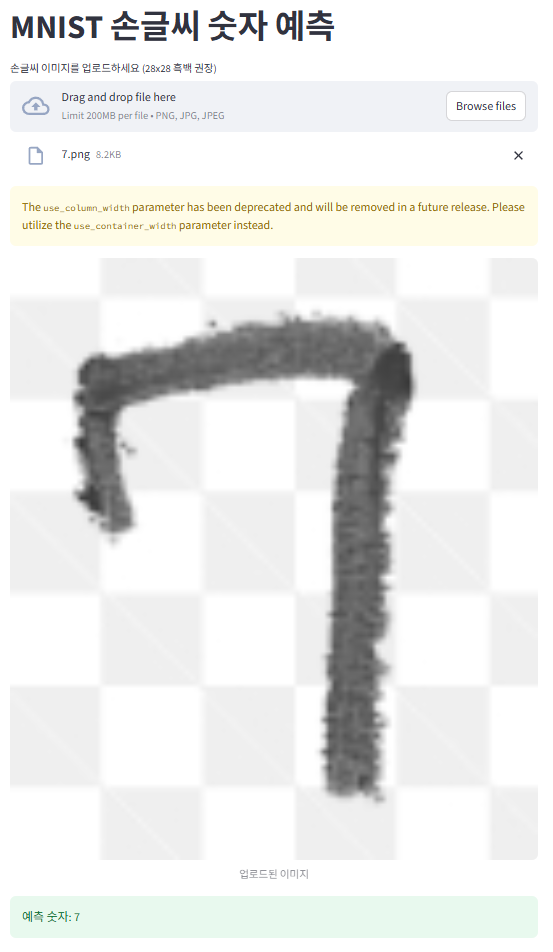

🖼️ Demo

Features

CNN 모델을 사용한 손글씨 숫자 분류

Streamlit 웹 앱으로 실시간 예측

GPU 지원 (PyTorch + CUDA)

초보자도 쉽게 실행 가능

Installation

GitHub에서 클론:
git clone https://github.com/OWO4731/mnist-digit-recognition.git
cd mnist-digit-recognition

패키지 설치:
pip install -r requirements.txt

Run the Streamlit App

streamlit run app.py

브라우저에서 앱 열기

이미지 업로드 후 숫자 예측 확인

Project Structure

mnist-digit-recognition/
├── model/ # CNN 모델 정의
│ └── mnist_cnn.py
├── data/ # MNIST 데이터 (자동 다운로드)
├── images/ # 예측/스크린샷 이미지
│ ├── 예측.png
│ └── streamlit_screenshot.png
├── saved_model.pth # 학습된 모델 가중치
├── app.py # Streamlit 웹 앱
├── train.py # 학습 스크립트
├── README.md
└── requirements.txt # 필요한 패키지

requirements.txt Example

torch==2.7.1+cu118
torchvision==0.22.1+cu118
torchaudio
streamlit
Pillow

필요에 따라 패키지 버전은 조정 가능

License

MIT

Author

DAYO
Email: hjzhsks@naver.com
GitHub: https://github.com/OWO4731
